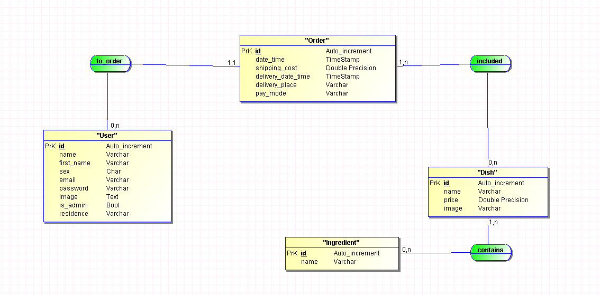

# 
 PARA DISH

## 
FOOD ORDER MANAGEMENT APPLICATION 

This web application is designed to manage food orders in a given 
restaurant. This is the backend side of the project.

## MCD:

## Technologies Used

- Back-End: Spring Boot, Java
- Database: PostgreSQL
- Front-End: [...]
- Testing: JUnit5
- Couverage: JaCoCo

## Prerequisites

- Java 21
- Maven [OPTIONAL - Depending on the build tool you're using]
- PostgreSQL
- intelliJ with spring initializer

## Above all:
- run the file in "database/autoRun.sql" in your postgresql terminal to get appropriate database.
- Customize connection information in "src/main/ressources/application.properties".
- If you're on vsCode like me: /src/main/java/FoodOrdersApplication.java".you'll find the manual launch point
  in "2-back-end

## OpenAPI-Explorer:
You can see directly the openApi of this project from

## Dev:
Tiana-Finaritra